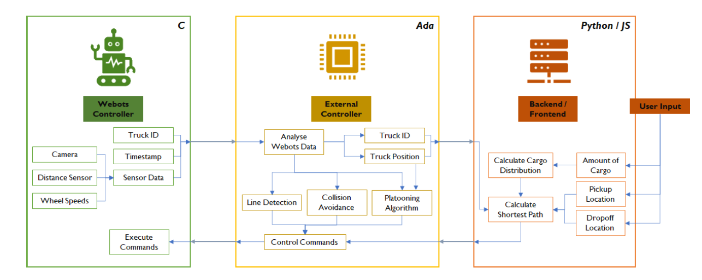
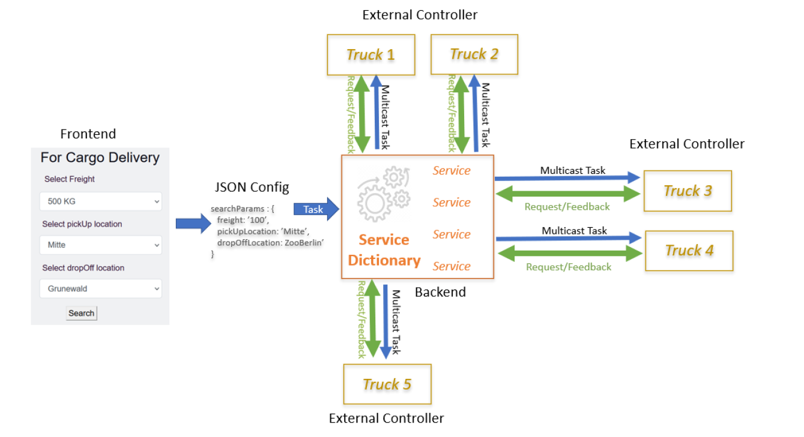
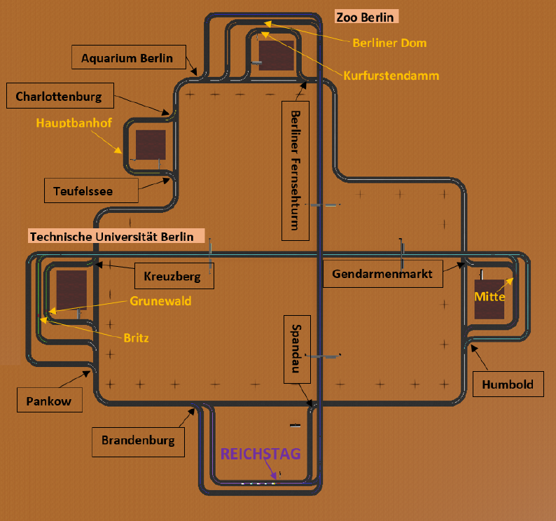
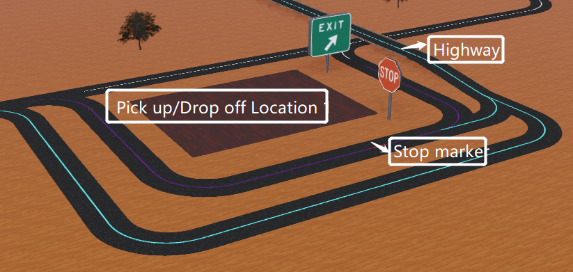
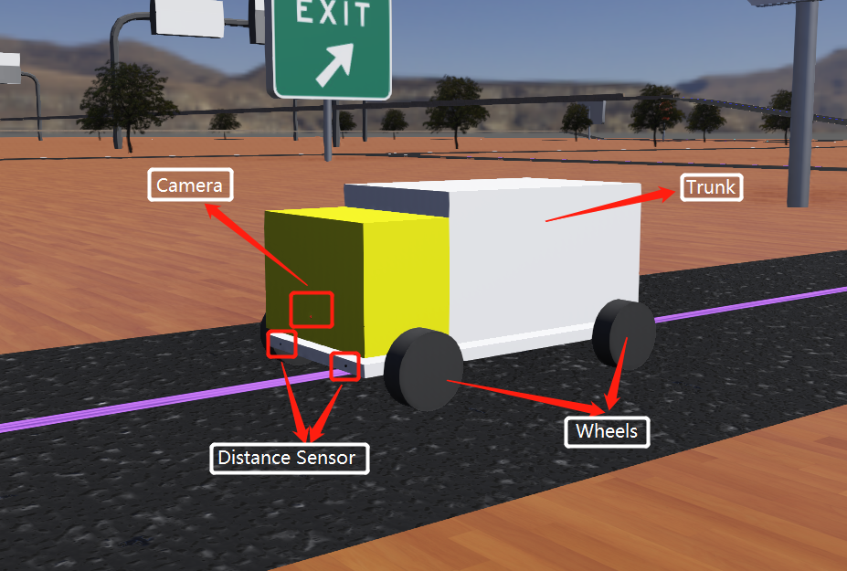
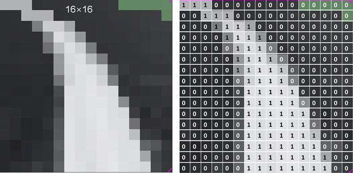
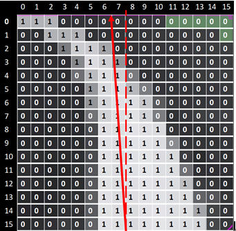
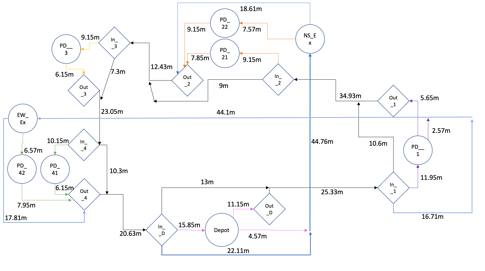

# Autonomous Truck Platoon: Team 2

## Group members:
TEODOR JANEZ PODOBNIK, LUBNA YAQOOB, RENE KRIEGE, LU KANG,
THAI HUY DO NGUYEN, CHENG PENG , AYUSCH KHAJURIA, YUKE QIAN

## Project Overview
Build an autonomous truck fleet that delivers cargo efficiently. 

### Goals

The main objective or goal of this project is to develop and build an intelligent anautonomous truck fleet that delivers cargo efficiently. The main goals of this project are:

1. Pick up cargo at predefined locations
* Trucks can  recognize stops at each location
2. Deliver cargo quickly to its destination
* Plan routes as short as possible  
3. Use available trucks and space per truck efficiently
* Reasonable distribution of cargoes
4. Platoon where possible, economical and safe
* Keep the safety distance between each Truck in Platoon
* get the Saved fuel consumption when Platoon 
5.  Avoid collisions
* Emergency stop when meet obstacles
6.  A booking Interface for User

## Requirements
To achieve the goal efficiently the requirements are segregated to three different parts (consisting its related module) that are difined below.

### Environment
Build a Highway system in Webots：
* multiple entries and exits of pickup and drop-off locations
* At least one depot for unused Trucks to park
* different routes to the destination

### Robot
Build a robot that interacts with the Webots environment:
* Only use the following types of sensors: ultrasonic distance sensor, camera, light sensor
* At least three robots in the environment

### Control
Use the components webots controller, external controller and backend:
* Use the general architecture from the overview presentation: implement a TCP
socket server in C for the Webots controller Determine the position of robots to achieve the mission
* Make the operation safe (communication failure, sensor failure…)
* Verify/validate the operation
* Delivery cargoes efficiency (shortest path, fuel consumption...)

## Approach
To handle this project efficiently we used.

### Project Management
We worked in a Agile based model, where we plan and preview things on weekly basis. We utilised a various quality assurance strategies to ensure the quality of our project, for example an automated deployment system to make sure the integrated piece code works well.

### Development
As mentioned above, we worked in component based teams (webots controller, external controller, back-end and front-end). Communication between these components are done through TCP/IP communication protocols. Up to first milestone we come up with some basic work on each component. Until the end of second milestone we achieved our requirements goals for environment and external controller. Up to the third milestone were accomplished to establish communication between external controller and back-end. our Webots component is developed in C language, whereas external controller consist of Ada language. For back-end development we used Python, where as front-end is in React JS. A complete insight of each component will be discussed in system architect section.

## System architecture
Our project consists of several components shown in a diagram below (just like the building pieces that comes together in a good solution), including webots-controller, external controller, back-end and front-end.



Due to the complexity of environment, autonomous trucks cannot be controlled by just one controller. Therefore, every truck has aWebots controller and an external controller, the backend processes all truck information. We use C-Program for Webots controller, Ada for external controller and Python for backend.

### Software design
For example, a user request cargo delivery from 'Mitte', a pickup location of cargo, to 'Grunewald's location to drop its freight of 500KG weight. How this procedure will work in all components will be explained in detail in this section with the help of image below.



As shown in the image we have three components interacting with each other. 'frontend', 'backend' and 'external controller'. Let see how it works all together. At first step, user send a request from the website to deliver 500 KG tomatoes, pickup from Mitte and drop it to Grunewald. This is a frontend request, and this frontend request information gets converted to JSON conguration, which then gets parsed to the backend.
Backend is a service dictionary that consist of multiple services. The backend does the calculations and triggers the trucks. So the backend will be like to calculate which truck is utmost optimal to perform this task. Backend will do the calculations, for example, which truck is the closest to Mitte and Grunewald, or which has enough cargo free space and so forth. So the backend will then trigger the suitable/right external controller, and it will do the job. At the same time, backed will only trigger these commands only to the available trucks, so it won't send this if the truck is busy. This means that it will only distribute tasks between the available trucks, so if the truck is busy, it doesn't considered in the cargo distribution. This is indicated by the blue arrow 'Multicast Task'. Then we have the green two way arrows that indicate the the request/feedback. So backend keep track of all the trucks, for example, truck 1 have 100 kilo of free cargo and it is in red street, or may be truck2 has 300 kilo of free cargo and its current position is in blue area. So truck1 needs to know where truck2 is. so it requests backend informaton where truck2 is. and backend will provide feedback to truck. this is why this is a two way arrow. gives him feedback and tells him where the truck2 is. and there are other options like (he can ask that is truck2 busy?) and so forth.

### Frontend design
This directory frontend is developed in React App. React App is an ocially supported way to create single-page React applications. It oers a modern build setup with no conguration. Originally, it is developed for user to get trucks information. We are consuming getTruckInfo method of backend api. On the frontend user is requseting to get a truck in the form of object to the api. For sending request to api, we have used axios to make an HTTP post request to the API. And if the response is success than this response is passed to the calling component/function. There are some services frontend provides:
* Communication between backend and frontend
* Sending request parameters to get truck information

### Backend design
We use Backend as Service Manager which will provide multiple service ready to be served on a client request. In our case clients will be External controllers, Frontend user.
There are multiple service Backend provides:
* Current position of each truck
* Current available free cargo space on each truck
* Locations of closest Pickup/Dropo location according to the client (position) that
requested it
* Option to deploy (one of the) truc

### Environment design

#### Overview
The environment will be the design as a highway system. It consists of multiple asphalt streets with road marking in different colors, 4 pickup and drop-off locations and a depot for unused trucks to park. 

#### Points of Interest
Points of interest are specific locations in the environment. It can help us get the position of our Trucks and accurately find the destination to deliver cargoes. There are totally three types of Points of Interest in our environment:

- Depot: 
Depot is the home of all Trucks. They can park here when they are not processing a job. Also when the Trucks finished their task, they will back to depot and waiting for new task.
- Pick up/Drop off Location:
There are four Locations in the environment with different line color.
- Two Highways:
There are two highways in the environment with different line color. It is used as the platoon sections and sometimes also the shortest way to get to the distination.



#### Road marking
There has totally road markings. The white lines which are positioned in the middle of the road, it used for trucks to navigate the path on the main road. The short red lines in each pick-up / drop-off location are used to stop, so that the trucks can stop a few second to pick up or drop off cargoes. Other lines with different colors are used to enter the different locations.



### Robot design
The robot (Truck) is a simple rectangular prism. It has six rectangular faces As can be seen in the image below, we use different colors for the different robots so that they are easily identifiable. The following hardware is used:

-   Rectangular prism body
-   4 wheels (two on each side)
-   3 sensors.  
     * one camera
     * two distance sensor (infra-red)
     
    
#### Lane dectection
The camera placed in front is used to detect different color lines on the road.
#### Front distance
The distance sensors are places at the front left and right sides of the Trucks to detect the distance between each Truck in platoon as well as obstacles on the road.  

### Platooning 
We create a multiple communication between each Truck in platoon. Each Truck has an array of Serverconnections and Clients. And we declare that in our world there are max 5 Trucks + only 5 Trucks can Platoon at a Time for safety reason. The Leader has is connected through Clients to every following car, while the other Trucks have just two Client-connections: one with the Leader and one with the Truck infront. This assure more safety in case of communications errors. In a degraded mode messages can be forwarded through the other Truck. Also when the leader Truck have a break to stop, due to the communication, the follower Trucks will also stop. 

  

### Algorithm
#### Follow Path
The Follow path package is the core component for driving. It based on the camera image. The key to processing the image is to let the truck know which kind of data is the color we want to follow.
Then use follow color white as an example:
-  Detect BGR value:
We use color_diff function to compare each pixel with BGR value of white, and 255 as a Threshold is used. If the result is smaller than 255, it will determine that the pixel is white, and if it is bigger than 255, it will determine that the pixel is not white. After this processing, we can obtain the BGR value array. 1 means white and 0 means not white.

  

```Ada
   function color_diff (a : color_BGR; b : color_BGR) return Integer is
      diff : Integer := 0;
      d    : Integer;
   begin
      for i in 0 .. 2 loop
         d := a (i) - b (i);
         if d > 0 then
            diff := diff + d;
         else
            diff := diff - d;
         end if;
      end loop;
      return diff;
   end color_diff; 
```

- Get steering angle:
Our Trucks always align themselves along the lines they follow. This is done by comparing the sum of the average values of all pixels and the index of the centerline.

  

- Follow multiple colors
We define 4 pick up/drop off locations and two highways with different colors. Then Truck should follow a color sequence in the environment. So we use an array of colors transmit to backend, backend calculate the route and send back the route as an array to external controller. Then the Trucks can follow multiple colors.

#### Postion determine
We create a node graph of our environment. By getting the current color line, the real simulation time from webots and the velocity of the Truck, we can directly know the truck is located on which street and how many meters it traveled on this street.

  

```Ada
function get_current_position (Image : image_array) return String is
 Speed       : Float;
 found_color : color_BGR;
 begin
 for I in 1 .. 9 loop -- loop all colors
 -- ((Colors (I) = Red) and find_new_color(Image, Colors (I))) or
 -- when we found a new color which is not our current line color, we are on a new crossroad
 if   (Colors (I) /= Curr_Line_Col and Colors (I) /= last_color and find_new_color(Image, Colors (I)) and Last_Found_Color /= Colors (I))
 then
 found_color := Colors (I);
 Last_Found_Color := found_color;
 last_color  := Curr_Line_Col; 
 
 -- get the next destination node and distance to this node
 Next_Node  := get_next_node(Curr_Line_Col, Next_Line_Col, Colors (I));
 Distance_Left := Distance;
 
 -- get the next color in our path
 if (Curr_Route_Pos <= Last_Route_Pos and ((found_color = Next_Line_Col or (found_color = Red and Curr_Line_Col /= Pink and Curr_Line_Col /= Violett) or (found_color = Red and Next_Line_Col = Violett) or (Curr_Line_Col = White and Next_Line_Col = White and found_color /= Blue and found_color /= Light_Blue))))
 then
 Curr_Line_Col  := Next_Line_Col;
```

#### Shortest path
We using Dijkstra's algorithm to find the shortest path.

#### Distribution Algorithm
This algorithm is distributing cargoes and assign cargoes to available Trucks to finish the task. 
 
 ```Python
def get_distribution(self, clients_free, cargo_request, optimum):  
    distrib = {}  
    for truck in optimum:  
        cargo_free = clients_free[truck]  
        if cargo_request > float(cargo_free):  
            distrib[truck] = int(cargo_free)  
            cargo_request -= int(cargo_free)  
        else:  
            distrib[truck] = int(cargo_request)  
            cargo_request = 0  
    print('distribution', distrib)   
    return distrib
```

## Summary
To summarize, In this project, we developed an intelligent system, ’an autonomous truck fleet’, that delivers cargo efficiently. The core concept of this system is that users can commandthe system to pick up a certain amount of freight/cargo from a specific location and drop it at a predefined area. Several trucks with predefined cargo space are availablein the depot that can be assigned if more trucks are required to deliver more freight. However, using available trucks and space per truck was decided by the system based on algorithm calculations to provide the best possible solution with one or more trucks to deliver the cargo efficiently and economically. The project mainly based on four majorcomponents Webots controller, external controller, back-end and front-end. Complete insight about each component is provided in the system architecture section that whatis the purpose of each component and how they work together.
